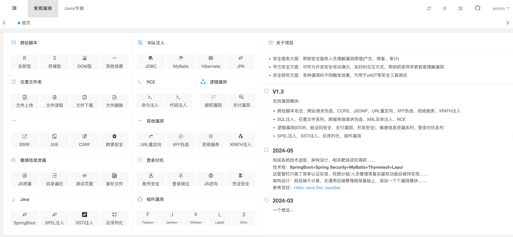
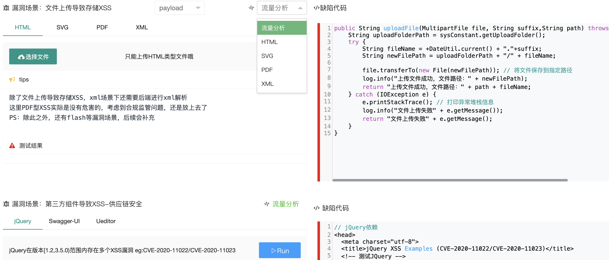
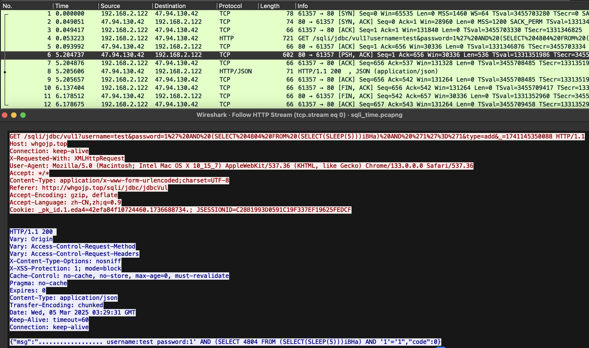

# JavaSecLab—A comprehensive Java vulnerability platform

<div align="center">
  <a href="https://www.apache.org/licenses/LICENSE-2.0.html"></a>
  <a href="https://github.com/whgojp/JavaSecLab"></a>
  <a href="https://github.com/whgojp/JavaSecLab"></a>
  <a href="https://blog.csdn.net/weixin_53009585"></a>
    
  
</div>


[中文文档😊](./README_ZH.md)

----------------------------------------

## Project introduction
​	JavaSecLab is **the most comprehensive Java vulnerability platform **, providing related vulnerability defect code, repair code, vulnerability scenarios, audit SINK point, security coding specifications, vulnerability traffic analysis, covering a variety of vulnerability scenarios, user-friendly interaction UI......




## public-facing

- Security services: Help security service personnel understand the principle of vulnerability (generation, repair, audit), and corresponding vulnerability traffic analysis

- Party A's security: It can be used as a development security training demonstration, a friendly interactive way to help R & D students more easily understand the vulnerability

- Security research: Different trigger scenarios for various vulnerabilities can be used for testing security tools such as xAST


## Support vulnerability module

- Cross-site scripting attacks, cross-site request forgery, CORS, JSONP, URL redirection, XFF forgery, denial of service, XPATH injection

- SQL Injection, arbitrary file family, cross-server request forgery, XML entity injection, RCE

- Logic vulnerabilities (IDOR, verification code security, payment security, concurrency security), sensitive information leakage series, login antagonism series

- SPEL injection, SSTI injection, deserialization, component vulnerabilities


## Online environment experience

http://whgojp.top/

Account password: admin/admin

## Project inspiration

​	**I have worked in Party A's unit for a period of time, and had access to the complete vulnerability life cycle ** : After completing penetration tests many times, I sent work orders (TAPD, Jira) to notify the R&D students to fix the vulnerability, and I often faced some problems: **1, the R&D did not know why this was a vulnerability? 2, R&D does not know how to fix this vulnerability? **
​	Thus, an idea 💡 arises spontaneously, and I happen to know some development knowledge, wondering whether I can let the R & D students quickly understand the generation and repair of loopholes through the way of code...

> The platform provides security coding specifications for relevant vulnerabilities, and Party A friends can consider joining the development of security training when doing SDL/DevSecOps construction

​	In addition, I have also done security service projects, I think most of my friends will be with me, just according to the information collection -> network -> Discovery of vulnerabilities -> output report this process test, for how the vulnerability is generated, how to repair, it seems not concerned...

​	In the process of code audit, it is common to locate the SINK point (that is, the key location of code execution or output) and then backtrack to find the corresponding SOURCE point (that is, the location of the input or data source). The code audit is done by concatenating the SOURCE and SINK points

> For each vulnerability, the platform provides the corresponding defect code and various security repair methods (such as: 1, upgrade repair 2, non-upgrade repair). At the same time, for code audit, the platform also provides the SINK point of related vulnerabilities

​	Later, contact with application security products, SCA, SAST, DAST, RASP, etc., looking at security vulnerabilities seems to be another Angle, for customers, the purchase of security tools, whether it is scanning source code, containers, images... Of course, I also hope to less false positives, the author has more or less access to accessibility analysis and other related technologies, the project has also written different trigger scenarios for each vulnerability, interested friends can test it...

> The platform provides multiple trigger scenarios for the same vulnerability

🆕 update the vulnerability traffic analysis module to facilitate teachers' reference and learning. Take the vulnerability traffic of this project as an example. If you have better vulnerability traffic packets, welcome to submit PR to participate in the project 🌹



Here, take delayed injection as an example: the traffic characteristic can be clearly seen from the response time: the server responds after 5 seconds



## Technical architecture

​	SpringBoot + Spring Security + MyBatis + Thymeleaf + Layui

## Deployment mode

clone the project code first

```shell
git clone https://github.com/whgojp/JavaSecLab.git
```


### Local deployment -IDEA

> JDK Environment 1.8

1. Configuration Database (**Mysql 8.0+**)

   Execute the sql/JavaSecLab.sql file

   Modify the configuration file application.yml active to dev(the project default is docker if there is a database connection error during the construction process, teachers can pay attention to here)

   ```yaml
   spring:
     # Environment dev|docker
     profiles:
       active: dev
   ```
   
2. Modify the application-dev.yml configuration file

```yaml
username: root
password: QWE123qwe
url: jdbc:mysql://localhost:13306/JavaSecLab?characterEncoding=utf8&zeroDateTimeBehavior=convertToNull&useSSL=false&useJDBCCompliantTimezoneShift=true&useLegacyDatetimeCode=false&serverTimezone=GMT%2B8&nullCatalogMeansCurrent=true&allowPublicKeyRetrieval=true&allowMultiQueries=true
```


Initial password: admin/admin(can be changed in the background)

### Docker Deployment (**Recommended**)

> Condition: docker and Docker-Compose are installed
>
> If the sql file is not initialized during docker deployment (that is, the database is empty), you need to manually import the sql file

```shell
mvn clean package -DskipTests
docker-compose -p javaseclab up -d
```


For details about deployment solutions and deployment questions, see：[Deployment guide](https://github.com/whgojp/JavaSecLab/wiki/%E9%83%A8%E7%BD%B2%E6%8C%87%E5%8D%97)

## Open source protocol

​	**When we speak of free software, we are referring to freedom, not price.**

This project follows [Apache License 2.0](http://www.apache.org/licenses/LICENSE-2.0) protocol，the detailed content of License please see the [LICENSE](./LICENSE) file。

## Update record

Project detailed record update, please refer to [update log](https://github.com/whgojp/JavaSecLab/wiki/%E6%9B%B4%E6%96%B0%E6%97%A5%E5%BF%97)

## A few Tips🙋

1. Security issues: Because it is a vulnerability shooting range, it is not recommended to use it on the public network
1. The security repair code in the project is for reference only, and the actual business vulnerability repair may be much more complex...
1. **Problem/Suggestion feedback: If you encounter some project problems or better suggestions, you are welcome to raise an Issue or add a communication group for feedback **
1. **See here, if the master thinks the project is useful, please move and click a star, thank you very much 🙏**

## About the author

Author's blog：[今天是几号](https://blog.csdn.net/weixin_53009585)

**If the master is also interested in development security, application security, SDL, vulnerability shooting range, etc., welcome to join the exchange group to discuss... **

<div style="text-align: center;">
    
      
</div>


## Sponsor open source

​	If you find this tool helpful, consider supporting the author's development efforts. Your sponsorship will be used to maintain the online server and continuously optimize the project function, thank you very much for your encouragement and support!

<div style="text-align: center;">
    
  </div>


